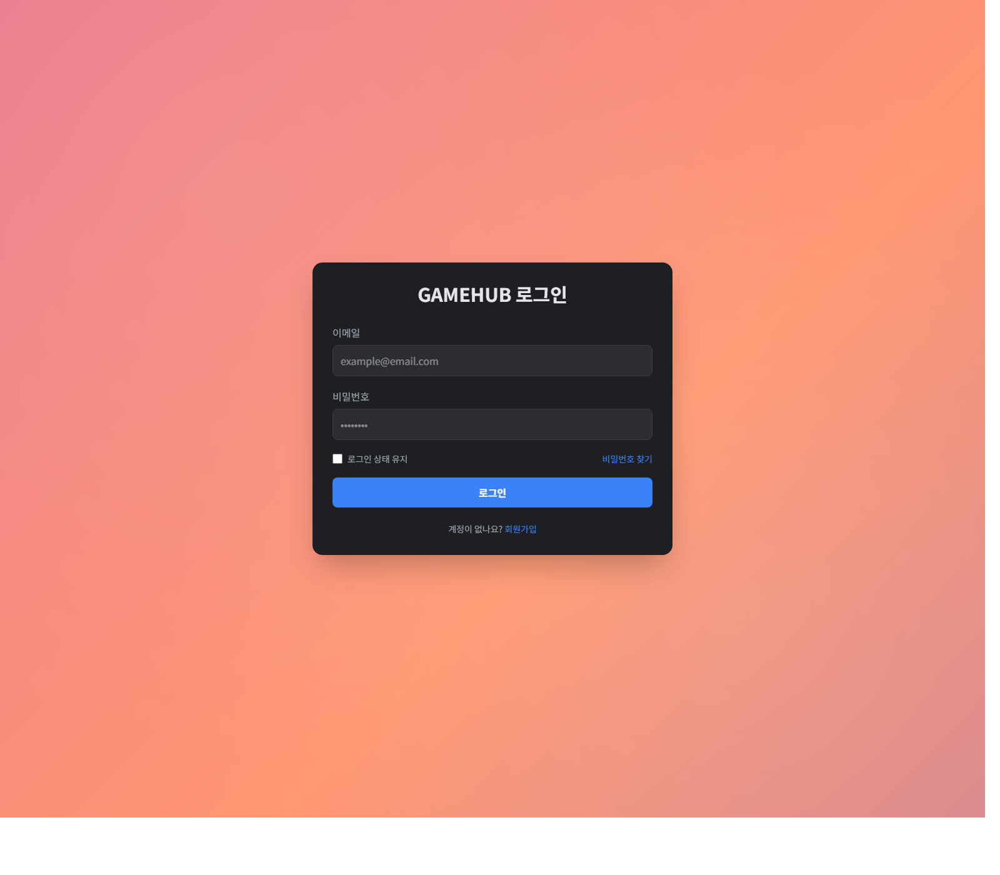
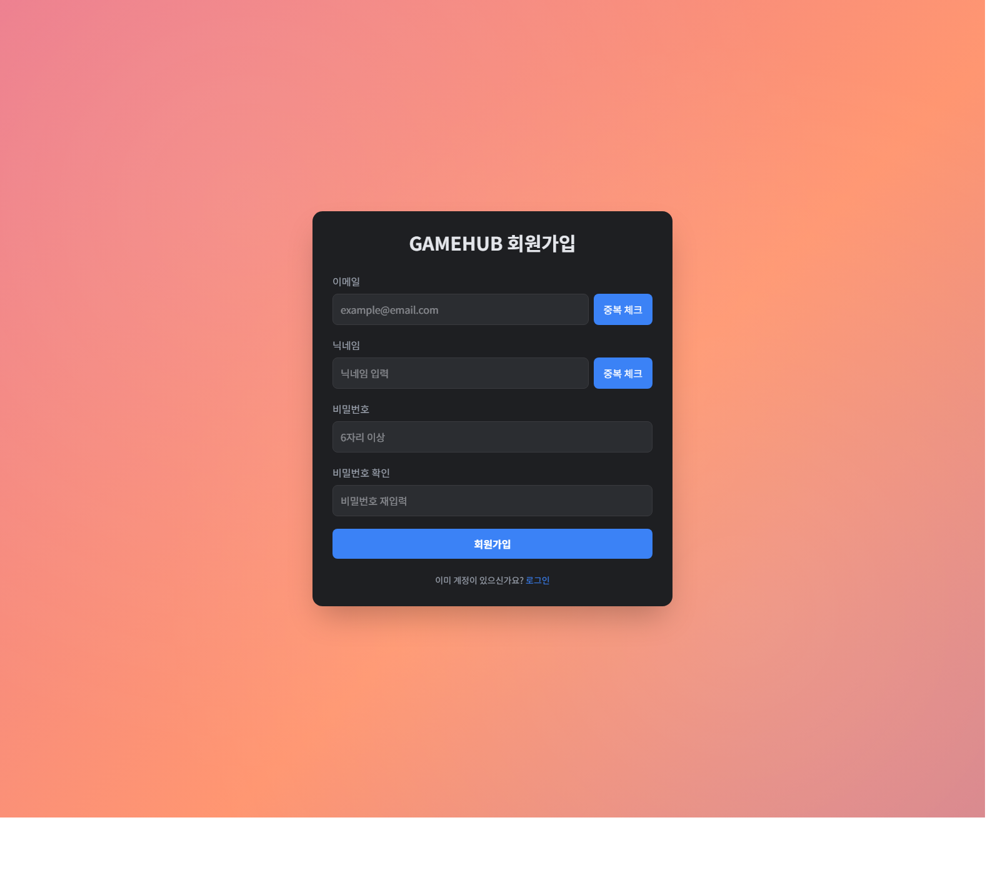
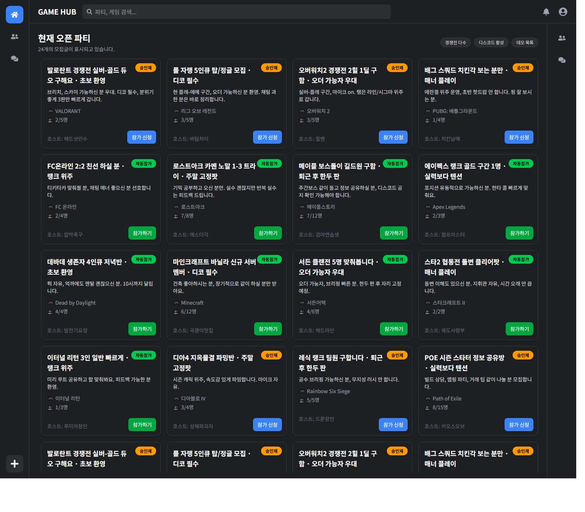

# GameHub

게임별 파티를 모집하고 친구, 채팅과 음성채널 접속 상태를 함께 관리하는 Spring Boot + React 웹 서비스입니다. 단순 CRUD를 넘어 파티 참가 방식과 멤버 권한, 실시간 통신의 인증·접근 규칙을 백엔드 도메인에 구현하고, 이를 여러 모듈과 하나의 배포 흐름으로 구성하는 데 초점을 맞췄습니다.

## 주요 화면

| 로그인 | 회원가입 |
| --- | --- |
|  |  |



## 서비스 흐름

1. 사용자가 회원가입·로그인 후 JWT를 발급받습니다.
2. 공개 파티를 조회하고 자동 참가, 승인 요청 또는 초대코드로 파티에 참여합니다.
3. `LEADER`, `MANAGER`, `MEMBER` 권한에 따라 참가 승인, 강퇴, 위임, 역할 변경과 뮤트를 처리합니다.
4. 파티 멤버는 REST로 이전 채팅을 조회하고 STOMP로 메시지와 읽음 상태를 실시간 공유합니다.
5. 음성채널 입장·퇴장·이동 상태를 저장하고 파티 토픽과 사용자 전용 알림 큐로 전달합니다.
6. React를 빌드한 결과는 `onion-user-api` 정적 리소스에 포함해 백엔드와 함께 배포합니다.

## 설계 및 구현

### 멀티 모듈 구조

| 모듈 | 책임 |
| --- | --- |
| `onion-domain` | 엔티티, Enum, Repository와 데이터 모델 |
| `onion-core` | 서비스, DTO, JWT 보안, 예외와 비즈니스 규칙 |
| `onion-user-api` | 사용자 REST API, WebSocket/STOMP와 정적 리소스 서빙 |
| `onion-admin-api` | 향후 운영 기능 분리를 위한 관리자 API 시작점 |
| `front-end` | React 라우팅, 인증·파티·친구 UI와 API 호출 |

### 인증과 실시간 통신

- REST 요청은 Spring Security와 JWT 필터로 인증하고, 쓰기 API는 인증 사용자만 접근하도록 분리했습니다.
- WebSocket 연결 시 JWT를 검증하고, 인바운드 채널에서도 인증되지 않은 `SEND`와 `SUBSCRIBE`를 차단합니다.
- 채팅과 음성 상태 변경은 서비스 계층에서 파티 멤버 여부와 뮤트 상태를 다시 검증합니다.
- 채팅 메시지는 `beforeMessageId` 기준으로 이전 데이터를 조회하고 사용자별 마지막 읽은 메시지를 저장합니다.
- 음성 접속 상태는 입장, 퇴장과 채널 이동을 구분하고 파티 토픽 및 `/user/queue/notifications`로 전파합니다.

### 파티 운영 규칙

- 자동 참가와 승인 참가 방식 분리
- 참가 요청 중복, 모집 마감, 정원 초과와 기존 멤버 여부 검증
- `LEADER`, `MANAGER`, `MEMBER`별 승인·강퇴·위임·역할 변경 정책 적용
- 시간 제한 또는 수동 해제가 가능한 뮤트 처리와 채팅·음성 진입 차단
- 충돌 여부를 확인해 재발급하는 8자리 초대코드 기반 참가 흐름

### 프론트 통합 배포

`onion-user-api`의 Gradle 작업이 `front-end`에서 `npm run build`를 실행하고, Vite 결과물을 `src/main/resources/static`으로 복사합니다. 프론트 개발 서버에서는 `/api`를 백엔드로 프록시하고, 배포 시에는 하나의 Spring Boot 애플리케이션에서 정적 화면과 API를 제공합니다.

## 기술 스택

**Backend**
`Java 21` · `Spring Boot 3.5.6` · `Spring Security` · `Spring Data JPA` · `WebSocket/STOMP` · `JWT` · `MySQL` · `H2` · `Gradle`

**Frontend**
`React 19` · `React Router 7` · `Vite 7` · `Tailwind CSS 4` · `Axios`

## 실행 방법

필수 환경변수:

```env
SERVER_PORT=8080
DB_URL=jdbc:mysql://localhost:3306/gamehub
DB_DRIVER=com.mysql.cj.jdbc.Driver
DB_USERNAME=your-username
DB_PASSWORD=your-password
JWT_SECRET=use-a-long-random-secret
JWT_EXPIRATION=3600000
```

백엔드와 프론트 통합 빌드:

```powershell
.\gradlew.bat build
.\gradlew.bat :onion-user-api:bootRun
```

프론트엔드 단독 실행:

```powershell
Set-Location front-end
npm install
npm run dev
```

## 현재 구현 범위

**구현됨**

- 회원가입·로그인, 이메일·닉네임 중복 확인과 JWT 인증
- 친구 요청·수락·거절·목록 API 및 프론트 패널 연동
- 파티 CRUD, 목록 페이지 조회, 자동·승인 참가, 초대코드와 멤버 권한 API
- 채팅 저장·이전 메시지 조회·읽음 상태와 STOMP 메시지 처리
- 음성채널 접속 상태, 파티 브로드캐스트와 사용자별 알림
- 인증·파티 목록·친구 기능의 React API 연동 및 통합 빌드

**추가 보완 필요**

- 파티 참가·관리, 채팅과 음성채널의 프론트 화면 및 STOMP 클라이언트 연결
- 관리자 API의 실제 운영 기능
- 서비스·권한·WebSocket 기능 테스트: 현재 테스트 태스크가 비활성화되어 있고 기본 컨텍스트 테스트만 존재
- 운영 환경용 마이그레이션 도구, `ddl-auto`와 SQL 로그 설정 분리
- WebSocket 허용 Origin 제한과 쿼리스트링 토큰 전달 제거

현재 코드는 백엔드의 핵심 서비스 흐름과 React 인증·목록 화면, 통합 배포 구조를 구현한 단계입니다. 모든 화면과 운영 기능이 완료된 상용 서비스로 설명하지 않습니다.
